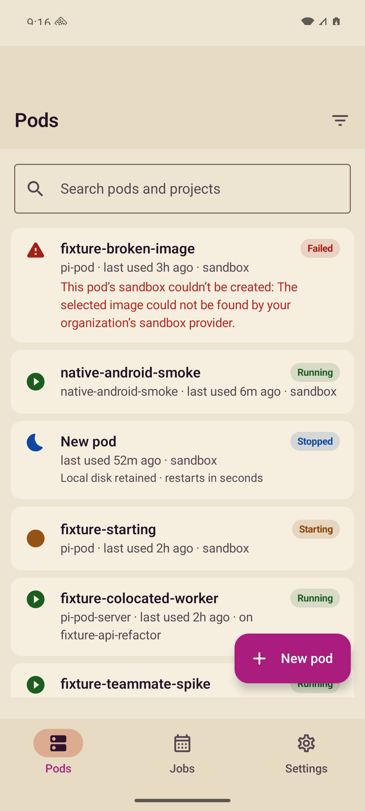
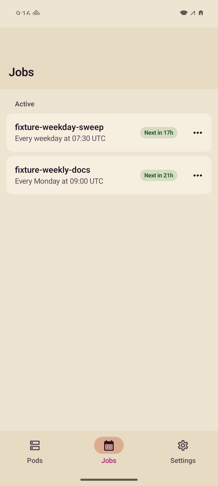
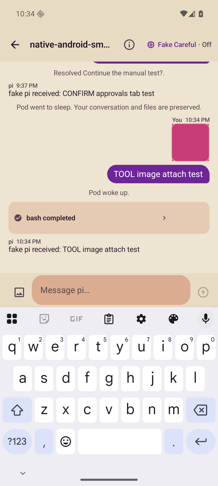
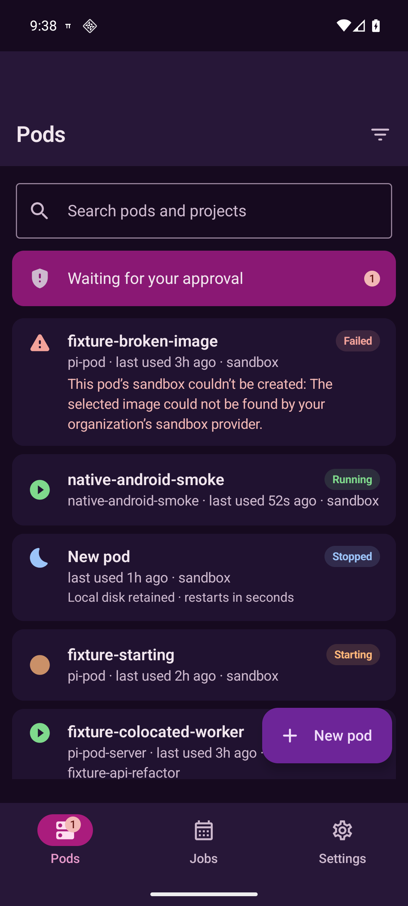
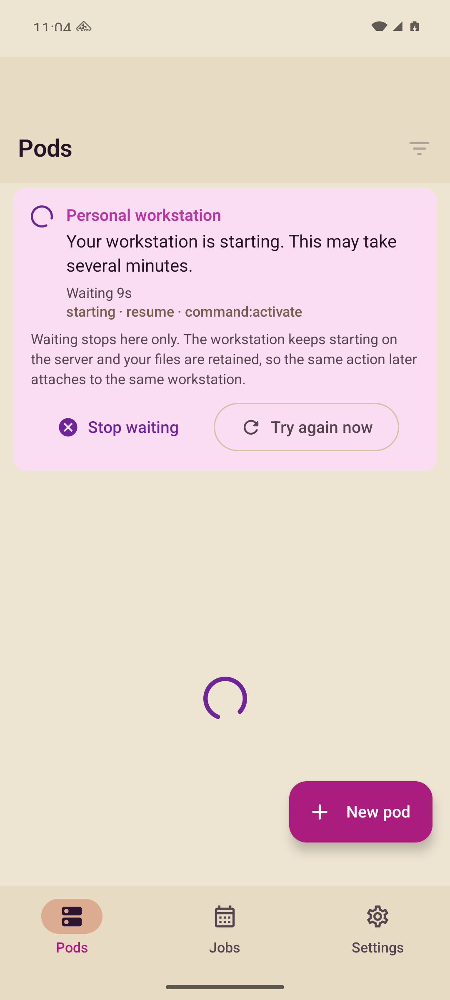
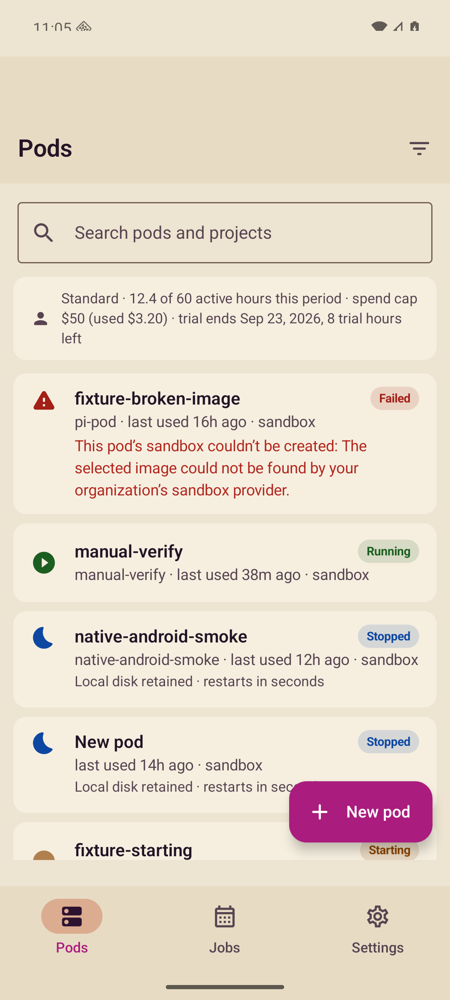
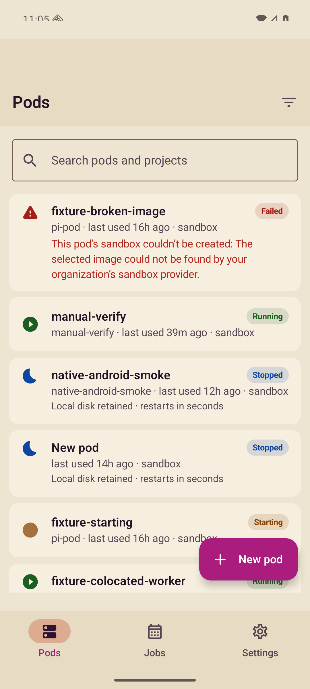

# Android manual testing

Historical record of how the native Android client was exercised by hand,
against which backend, and what was explicitly not run at the time. Commands,
test counts, and suite references below describe past runs, not the current gate:
unit tests and isolated component tests have since been removed. Current CI
assembles debug, instrumentation, and release artifacts and runs a test-qualified
AuthGate/SessionStore integration smoke alongside a production startup check.
This file records what was visually inspected.


## Self-hosted pass (2026-10-01)

Exercised by hand on an owned simulator/emulator against a self-hosted deployment
(`selfhost/upgrade`, real Zitadel, real sandbox, Fireworks), with the server chosen on the
sign-in screen rather than by launch argument:

- choosing the server (bad address, plain HTTP refused, loopback accepted), browser
  sign-in against the self-hosted Zitadel, the choice surviving relaunch, sign-out returning
  to the app with the provider session ended, **Use pi pod cloud**;
- Settings shows the account's email ("Signed in as"), not its id;
- launching an empty pod and one from an environment; a first message sent while the sandbox
  prepares runs on the model last chosen, as does a new pod's first catalog; a session title
  generated by a reasoning model;
- a launch refused because the server is full says so, with the memory figures, and offers
  no composer; deleting a pod returns to the list; tapping a live pod opens its conversation;
- stop, archive (which stops), restore, delete; secrets add/delete; provider test/connect;
  environments create; jobs list/detail and **Run now**.

Not exercised: approvals (no default pod extension raises one), push notifications, image
and file attachments, organization switching, a Release build against a public HTTPS server.

Approvals were removed after this pass (2026-10-02). There is no Approvals inbox, tab or pod-list
row, no approval badge or "Approval needed" banner, no `pipod://interaction/…` link and no REST
resolve any more. A question an extension asks (`confirm`, `select`, `input`, `editor`) appears as
a card at the end of its conversation and is answered over the session socket; the gateway re-sends
it on every attach until some client answers. Older entries below that mention approvals describe
the app before that change.

## Testing on a remote Mac

Any local emulator works with plain `adb`. To offload to a Mac reached over Tailscale
SSH, use the helpers below; the Mac may be shared, so use your own workdir and emulator.
Historical evidence below names the devices/backends used then, not today's defaults.

```bash
export PIPOD_MAC_HOST=you@your-mac   # Tailscale SSH target
export PIPOD_MAC_WORKDIR=work/android-my-run/pi-pod-android
export PIPOD_DEVICE_SERIAL=emulator-5554   # an emulator you started on the Mac
./scripts/mac-build.sh :app:assembleDebug
./scripts/device.sh install
./scripts/device.sh launch
./scripts/device.sh ui
./scripts/device.sh tap 300 600   # select coordinates from the actual hierarchy/image
./scripts/device.sh shot after-action  # open and inspect the resulting PNG
```

The helpers use the Tailscale CLI, preserve build status, and default to
emulator `emulator-5554` and Java 21 at
`~/Library/Java/JavaVirtualMachines/temurin-21.jdk/Contents/Home` (`PIPOD_MAC_JAVA_HOME`).
The SDK is `~/Library/Android/sdk`. Verify the project's `android-37.0` compile platform
on the Mac before building.

The installed Android application ID is `com.pipod`; the Kotlin namespace stays
`com.pipod.app`. Launch activity `com.pipod/com.pipod.app.MainActivity`.
Use a normal app APK for exploratory testing, not a test-qualified harness.

Reverse-forward your isolated API/OIDC ports with
`tailscale ssh "$PIPOD_MAC_HOST" -N -o ExitOnForwardFailure=yes -R ...`, bound
to Mac loopback, then use serial-qualified `adb reverse` for each actual port.
The helper's `reverse` action uses historical fixture ports 18082/18094;
choose/forward those deliberately or use its `adb reverse` action with your own.
Confirm API reachability from the Mac and emulator before testing sign-in.

Use real taps, text, swipes and back actions; take/inspect screenshots after
meaningful changes. Record revision/build, host/user, serial/runtime, backend,
expected/actual results, crashes and gaps. Do not delete/kill the configured
shared AVD or affect another tester's files. Clean up only owned run artifacts.

## Environment

- Device: `emulator-5560` (AVD `pipod-sa-resume`, API 36 google_apis, arm64)
  on the shared build Mac, driven with `scripts/device.sh` against the pinned
  serial. The Mac is shared: never use a bare `adb shell` without the serial.
- Backend: the isolated fake-provider server at `http://127.0.0.1:18082`
  (see `/tmp/native-migration/README.md`), reached from the emulator through
  `adb reverse`. JWKS at `http://127.0.0.1:18092`.
- Identity: the throwaway OIDC fixture at `http://127.0.0.1:18094` — not
  Zitadel, no password, no real account. A temporary no-CSP fixture on
  `:18095` was also used for A/B diagnosis; the corrected flow was verified
  on `:18094`.
- Raw proof: `manual-evidence/*.png` (git-ignored, kept on the workstation).
  Filenames below refer to that directory.
- Published proof: `docs/screenshots/` holds curated copies safe to ship
  (no tokens, no secrets, fixture names only):
  ,
  ,
  ,
  .
  The M5 pass below adds
  ,
   and
  .

### M5 fixture: the workstation/billing stub

The M5 workstation and billing states cannot be produced against the shared
fake backend (it never 503s and never sends `billing`), so the M5 screenshots
below were taken against a tiny loopback stub on the Mac
(`http://127.0.0.1:18083`, forwarded with `adb reverse tcp:18083 tcp:18083`)
that forwards everything to `:18082` untouched except per mode file:

| Mode | `GET /v1/pods` answers |
|---|---|
| `workstation` | The contract's live 503 host-demand shape (`host_starting`, validated
`hostId`/`statusHref`, `retryAfterMs` 10000, a `resume` operation with a live
`deadlineAt`), so the list enters the shared wait. |
| `billing` | The upstream 200 with a full `billing` object injected into the envelope. |
| `absent` | The upstream 200 forwarded byte-identical (no `billing` key anywhere). |

Plan names, hours, caps and trial figures in these screenshots and the results below are
stub fixtures, not hosted plan terms.

The app was cold-started with `-e PIPOD_SERVER_URL http://127.0.0.1:18083 -e
PIPOD_DEV_TOKEN <dev token>` (debug only). Every screenshot below was looked
at: the anchor sentence, the elapsed tick, the technical detail, the billing
segments and the silent-absence case were all read off the pixels, not trusted
from a harness.

Fake-provider caveat: the agent is a deterministic script (`TOOL`, `SLOW`,
`CONFIRM` / `SELECT` / `INPUT` / `EDITOR`, `REMOTEUI`), not a model, and the
sandboxes are not real VMs. Anything below that exercises an agent turn proves
the client's protocol handling (stream/message/tool frames, interrupt,
approvals with `type: "extension_ui_response"`, reattach replay), not model
behaviour or real provisioning.

## Final automated gate

The final full-source run passed on the owned emulator:

| Check | Result |
|---|---|
| JVM tests | 879 tests in 77 suites; zero failures/errors/skips |
| Instrumented tests | 259 tests; zero failures/errors/skips |
| Debug APK | Built successfully |
| Unsigned Release APK / R8 | Built successfully; no debug signing fallback |

Command: `scripts/mac-build.sh :app:assembleDebug :app:testDebugUnitTest :app:assembleRelease :app:connectedDebugAndroidTest`.
The run reported `BUILD SUCCESSFUL` and `__PIPOD_GRADLE_EXIT__=0`; JUnit XML
counts were checked independently. An intentionally invalid Gradle task returned
exit 1, confirming the helper does not trust Tailscale SSH's lost exit status.

## M5 verification gate (`m5/workstation-ux`)

Same command, run per stage against the shared build Mac. The device the docs
pin (`emulator-5560`) no longer exists; the one running emulator is
`emulator-5564` (AVD `pipod-fix-features`), so every device step below used
`PIPOD_DEVICE_SERIAL=emulator-5564` with the pinned serial still named
explicitly — never a bare `adb shell`. Builds ran in an isolated Mac workdir
(`work/android-m5b-android`), never in another agent's checkout.

| Check | Result |
|---|---|
| JVM tests | 721 tests in 67 suites; zero failures/errors/skips (JUnit XML counted) |
| Instrumented tests | 239 tests; zero failures/errors/skips (device `pipod-fix-features`, XML counted) |
| Unsigned Release APK / R8 | Built successfully (`:app:assembleRelease`, `BUILD SUCCESSFUL`) |
| Manual screenshots | Rows 42–44 below; every shot looked at, secret-free, curated under `docs/screenshots/` |

## Matrix

| # | Flow | Status | Evidence |
|---|---|---|---|
| 1 | Signed-out screen | PASS | `04-signed-out.png` |
| 2 | Sign-in launches the system browser (Custom Tab) | PASS | `05-oidc-browser.png`, `10-authorize-page.png` |
| 3 | Forged callback (`code`/`state` not from this attempt) refused, stays signed out | PASS | `13-app-invalid-callback.png` |
| 4a | Full browser PKCE sign-in → signed in | PASS | `07-after-oidc-signin.png`, `09-app-after-callback.png`, `11-after-consent.png`, `15-oidc-signed-in.png`, `08-oidc-signed-in.png` |
| 4b | Same against the CSP-corrected fixture (`form-action 'self' pipod:`) | PASS | `17-oidc-18094-cspfix.png`; A/B probes `12-probe-b-nocsp.png`, `14-authorize-nocsp.png` |
| 4c | Restart restores the session from the keystore (no browser, no dev token) | PASS | `16-restart-restored.png` |
| 4d | Dev-token sign-in (`-e PIPOD_DEV_TOKEN`, debug only) | PASS | `03-devtoken-signed-in.png` |
| 4e | Browser dismissed / sign-in cancelled → stays signed out | PASS | observed, no PNG (browser back, no callback delivered) |
| 5 | Pods list with states (failed / running / stopped / starting / co-located / teammate) and grouping | PASS | `20-pods-list.png`, `21-pods-list-signed-in.png`, `60-final-pods.png`, curated `screenshots/pods-list.png` |
| 6 | Pods search | PASS | `22-pods-search.png` (keyboard up, results filtered) |
| 7 | Pods filter sheet | PASS | selected Failed, selected All, cleared the filter (`112`–`117`); [filtered list](screenshots/filter-failed.png). Not an exhaustive combinations matrix |
| 8 | Pod detail (resolved config, capacity, launch report) | PASS | `23-pod-detail.png`, `29-launched-pod.png` |
| 9 | Pod actions: archive confirm → archived → restored | PASS | `24-pod-actions.png`, `30-archive-confirm.png`, `31-archived.png`, `32-restored.png`; API confirms `state=archived` then `active` |
| 10 | Launch a new pod | PASS | `25-launch-flow.png`, `26-launch-flow.png`, `28-launch-screen.png`, `29-launched-pod.png`; server row created |
| 11 | System back pops a detail screen to the list | PASS | `27-back-pops-to-list.png` |
| 12 | Deep link opens the right target (`pipod://job/…` → Jobs tab, job route) | PASS | `02-deeplink-job.png` |
| 13 | Session open + live transcript | PASS | `33-session-open.png`, `34-session-open.png`, `35-session-live.png` |
| 14 | Composer draft + send | PASS | `36-composer-typed.png`, `37-tool-turn.png` |
| 15 | TOOL turn renders the tool card and the result | PASS | `37-tool-turn.png`, `38-tool-turn-result.png`, curated `screenshots/session-tool.png` (`bash completed`, `Pod woke up`) |
| 16 | CONFIRM approval answered inline | PASS | `39-confirm-card.png`, `40-confirm-answered.png` |
| 17 | SELECT approval with options answered inline | PASS | `41-select-card.png`, `42-select-options.png`, `43-select-chosen.png`, `44-select-answered.png` |
| 18 | INPUT approval answered inline | PASS | `45-input-card.png`, `46-input-answered.png` |
| 19 | EDITOR approval answered inline | PASS | `47-editor-card.png`, `48-editor-answered.png` |
| 20 | SLOW turn + interrupt | PASS | `49-slow-running.png`, `50-interrupt.png` (`[interrupted]`, `Pod went to sleep`) |
| 21 | Model picker opens, model + thinking switch sticks | PASS | `51-model-picker.png`, `52-model-switched.png` (`Fake Fast · Off`) |
| 22 | Remote extension UI surface opens from a turn | PASS | transcript in `37-tool-turn.png` (`REMOTEUI open a surface`); close path via `REMOTEUICLOSE` keyword exercised, no PNG |
| 23 | Sleep → wake reattach preserves the conversation | PASS | `38-tool-turn-result.png` (`Pod went to sleep…`, `Pod woke up`) |
| 24 | Image attachments | PASS | system picker selection, stage, remove, reselect, send PNG with TOOL prompt (`101`–`106`); [sent image](screenshots/session-tool.png), descriptor replay after reopening (`109`). Fake model does not inspect pixels |
| 25 | Release build ignores launch extras (`PIPOD_DEV_TOKEN`/`PIPOD_SERVER_URL`) | PASS | `53-release-ignores-extras.png` |
| 26 | Release build points at the production issuer, no loopback | PASS | `54-release-prod-issuer.png` |
| 27 | Jobs list | PASS | `61-final-jobs.png`, curated `screenshots/jobs-list.png` |
| 28 | Job detail (schedule sentence, prompt, runs-with) | PASS | `62-job-detail.png` |
| 29 | Job runs section | PASS | `63-job-runs.png` |
| 30 | Job delete confirmation dialog | PASS | `64-job-delete-confirm.png` (dialog copy verified; the ambiguous `Delete job nightly` accessibility label found here is fixed — confirm action is now `Confirm delete job {name}` — historically pinned by the now-removed `JobDetailScreenTest.deletingIsConfirmedBeforeItHappens`) |
| 31 | Job pause / resume commands against the live backend | PASS | Pause and Resume tapped and server state verified (`118`–`120`); [resumed job](screenshots/job-resumed.png). The current server's `activate` endpoint is a compatibility alias for resume; it was also checked through the API |
| 32 | Settings opens at the top, sections render | PASS | `65-settings.png`, `67-settings-top.png`, `68-settings-opens-at-top.png`, `66-settings-lower.png`, `69-settings-secrets.png` |
| 33 | Organization + user config bundles render and save | PASS | `70-user-bundle.png`, `71-bundle-save.png` |
| 34 | Notification permission prompt → granted | PASS | `72-notification-permission.png`, `73-notif-before.png`, `74-notif-prompt.png`, `75-notif-granted.png` (local banners only — no FCM) |
| 35 | Environments list / detail / editor CRUD | PASS | `76-environments.png`, `77-environment-detail.png`, `82-env-editor.png`, `83-env-editor.png` |
| 36 | Environment secrets + normalization + save + delete | PASS | `78-env-secrets.png`, `79-secret-normalization.png`, `80-secret-saved.png`, `81-secret-deleted.png` |
| 37 | Settings proposal detail → applied, secret prefill path | PASS | `84-proposal-detail.png`, `85-proposal-applied.png`, `86-secret-prefilled.png`, `87-secret-form-prefill.png` |
| 38 | Model-provider credentials list loads; connect sheet renders | PARTIAL | `65-settings.png` (`Loading model providers…`); live provider OAuth exchange not exercised (no real provider; UI + view-model tests cover the sheet) |
| 39 | Approvals: badge, entry point, list, detail, resolve | PASS | `88-pods-with-badge.png`, `89-pods-badge.png`, `90-pods-approvals-entry.png`, `91-approvals-list.png`, `92-approval-detail.png`, `93-approval-tab-resolved.png`, `94-approvals-after-resolve.png` |
| 40 | Light / dark theme | PASS | light throughout; dark `95-dark-approvals.png`, `96-dark-pods.png`, curated `screenshots/pods-dark.png` |
| 41 | Keyboard layout, draft preservation | PASS | keyboard verified (`22`, `36`); typed draft, left session, reopened and verified unchanged text (`107`–`110`), [retained draft](screenshots/draft-retained.png) |
| 42 | Workstation-starting state (M5 stub `workstation` mode) | PASS | `m5a3-wait.png`, curated [workstation starting](screenshots/workstation-starting.png): the `Personal workstation` card with the verbatim anchor, a live `Waiting 9s` tick, `starting · resume · command:activate`, the cancel explanation, and `Stop waiting` / `Try again now` — no fleet, capacity, archive or duplicate copy anywhere on screen |
| 43 | Billing row present (M5 stub `billing` mode) | PASS | `m5b-billing.png`, curated [billing present](screenshots/billing-present.png): one account row reading `Standard · 12.4 of 60 active hours this period · spend cap $50 (used $3.20) · trial ends Sep 23, 2026, 8 trial hours left` — every segment sent by the stub, nothing computed |
| 44 | Billing row absent (M5 stub `absent` mode) | PASS | `m5c-no-billing.png`, curated [billing absent](screenshots/billing-absent.png): the same screen with the search field followed directly by pod rows — no placeholder, no zeroes, no empty section, no layout gap, and no `active hours` node in the accessibility tree |
| 45 | Settings account card carries the same billing summary | PASS | historical connected `SettingsScreenTest.theAccountCardShowsTheBillingSummaryItWasSent` + `theAccountCardShowsNoBillingRowWhenNothingArrived` (now removed; then 239-test suite, zero failures); same segments, same silent-absence rule as the pods row |

## Defects found and fixed during the acceptance passes

1. **Custom Tab launched into its own task** — `FLAG_ACTIVITY_NEW_TASK` from
   the application context meant the `pipod://auth/callback` redirect never
   returned to the `singleTask` activity; sign-in hung on "Signing in…".
   Fixed by launching the tab from the activity.
2. **The shell swallowed system back everywhere** — back-twice-to-exit was
   enabled on every tab screen, so back on a pod detail did nothing. Now
   enabled only at a tab root (`27-back-pops-to-list.png`).
3. **A refused callback blamed the network** — a state mismatch threw
   `IllegalStateException`, which `FriendlyError` maps to its transport
   fallback. Now an `ApiError` with sign-in copy (`13-app-invalid-callback.png`).
4. **`AppTextField` replaced the visible label with the accessible one** —
   fixed so the accessible name is a content description.
5. **Material 3's extended FAB exposes no accessible name** — now named
   explicitly (pinned by UI tests).
6. **Job detail trigger/confirmation shared a name** — the detail's `Delete
   job {name}` button and its confirmation both exposed `Delete job {name}`,
   so the UI test found two nodes (`final-androidtest.log`, 226 tests /
   1 failure). The confirm action is now `Confirm delete job {name}` (and
   `Confirm activate job {name}` for symmetry); the final full-suite re-run
   is the proof. Rule documented in `docs/jobs-settings-screens.md`.

7. **Outgoing message contrast** — outgoing text inherited the dark body-text
   color on an opaque purple bubble. It now explicitly uses `onAccent`
   (`destructive` for errors), and pending bubbles no longer fade the background.
   Six rendered-text regression tests cover light/dark delivered, pending and
   error states. The corrected UI was visually verified (`100`, `106`, `109`).

## Fixture defect found and reported (root fixed it)

The consent page's `Content-Security-Policy: … form-action 'self'` blocked
Chrome's redirect to `pipod://auth/callback` silently: consent succeeded, the
code was minted, and the browser stayed put. Isolated with an A/B probe —
same server, same target URI, same gesture, CSP the only difference. Root's
corrected header (`form-action 'self' pipod:`) is verified end to end
(`17-oidc-18094-cspfix.png`).

## Finalization re-verification (post-fix build, this pass)

After the initial full suite went green, the freshly built debug APK was
installed on `emulator-5560` and cold-started with the fake backend
(`PIPOD_SERVER_URL http://127.0.0.1:18082`, fixture issuer `:18094`,
dev-token extra) without rebuilding. All three tabs rendered live data:
`97-final-verify-pods.png` (pods list), `98-final-verify-jobs.png` (jobs
list), `99-final-verify-settings.png` (account + providers + secrets).
A further visual pass verified image staging/removal/send, replay, retained drafts,
representative filters, job pause/resume, and corrected message contrast (`100`–`120`).
Root inspected the resulting screenshots and ran the final automated gate above.

## Round 2 fixes (this pass)

Gate: `scripts/mac-build.sh :app:assembleDebug :app:testDebugUnitTest
:app:assembleRelease :app:connectedDebugAndroidTest` on the shared Mac, against
`emulator-5564` (AVD `pipod-fix-features`, API 36) and the isolated fake backend
on `:18082`. Screenshots for this pass live outside the repo, under
`/tmp/native-fix2/android-features-shots/`.

| Check | Result |
|---|---|
| JVM tests | 1011 tests in 101 suites; zero failures/errors/skips (JUnit XML counted, merged round-2 tree) |
| Instrumented tests | 301 tests; zero failures/errors/skips (`pipod-fix-features`, XML counted) |
| Debug APK | Built successfully |
| Unsigned Release APK / R8 | Built successfully; no debug signing fallback |

The round-2 work added 131 JVM cases (24 new `*Round2Test.kt` suites across both
slices, one of them parameterised over eight colour pairings) and 42 instrumented
cases, measured on the merged tree.

| # | Round-2 flow | Status | Evidence |
|---|---|---|---|
| R1 | A transcript carrying `[x](https://…)`, `[x](pipod://…)` and `[x](file:///…)`: only the web link is a link; the other two render as the markdown the agent wrote, unstyled and untappable | PASS | `03-transcript-links.png`; tapping the inert runs did nothing and logcat carried no `FileUriExposedException`/`ActivityNotFound` (`05-inert-links-no-crash.png`) |
| R2 | Tapping the web link asks first and names the destination host | PASS | `04-link-confirm.png` — `Open example.com?` / "This link came from the conversation. It opens https://example.com outside pi pod." Cancel returned to the transcript with no browser |
| R3 | Sign-in recreated while the Custom Tab is open (rotate + `am kill`, then back) | PASS | `06-signed-out.png` → `07-signin-browser.png` → `08-after-recreate-landscape.png`; the accessibility dump reads `content-desc="Sign in" … clickable="true" enabled="true"` — it used to come back disabled reading "Signing in…" |
| R4 | The flattened pod list scrolls, groups co-located children, discloses hidden statuses and filters | PASS | `09-list-after-signin.png`, `10-list-scrolled.png` (`Show 1 archived`), `11-list-filtered.png` |
| R5 | The same list in dark mode | PASS | `12-list-dark.png` |
| R6 | `AppColors.noticeText` in dark: the approval card title over its 12% wash | PASS | `13-approval-card-dark.png` |
| R7 | The approvals badge and row refresh on foreground after the approval was answered elsewhere | PASS | `14-badge-three.png` (3) → answered through the API while backgrounded → `15-badge-after-foreground.png` (2, `Open pending approvals, 2 pending`) |
| R8 | An org-scoped job is labelled on the list and on the detail | PASS | `16-jobs-shared-chip.png` showed the chip ellipsising against `StatusChip`'s 128dp cap, fixed to `Shared with org` in `17-jobs-shared-chip-fixed.png`; `18-job-detail-scope.png` carries `Scope · Shared with organization` |
| R9 | Pausing a shared job asks first, in the organization's words | PASS | `19-pause-shared-confirm.png` |
| R10 | The bar title ellipsises a long pod name | PASS | `round2-features-man…` in `03`, `04`, `05`, `13` |
| R11 | The account row and the settings account card stay silent on a backend with no billing surface | PASS | `01-pods-list.png` (no account row), `20-settings-account.png` (no Billing row, no warning). This backend answers `GET /v1/billing/account` with 404 and sends no `workstation` block on `/v1/me` |

Not reachable on this backend, and therefore still covered only by tests: the
workstation wait card and its supersession, the billing alert copy, the composer's
64 KiB refusal, `waiting-for-capacity`, and the session route's wait card. The
fake provider never 503s with a host demand, never queues for capacity and sends
no billing block; the M5 stub that can fake the first two lives on the build Mac,
not in this repo.

## Explicitly NOT RUN

- **Genuine production Zitadel** (`https://auth.pipod.dev`): every browser
  flow above used the throwaway fixture on `:18094`. No real account, no
  refresh-token rotation against Zitadel, no consent-screen copy review.
- **Remote Android push is not configured**: Firebase is not wired into this
  app, matching the retired Flutter client's optional token source. Only
  notification permission and local approval banners were exercised. There
  is no verified FCM registration, delivery or background notification wake.
- **Real sandbox provider**: launches, wakes, archives and restores hit the
  fake gateway. Real VM provisioning, capacity waits (the fake never queues,
  so wait-cancel is NOT RUN), and provider error surfaces are untested.
- **Production signing + Play**: release verification is an **unsigned**
  R8 artifact (`assembleRelease` without signing credentials, which fails
  closed rather than falling back to the debug key). No keystore has been
  minted (do not invent one — Play activation needs the 5 repo secrets and
  explicit user authorization) and nothing has been uploaded to any track.
- **Real model-provider credential exchange**: provider OAuth / API-key
  validation against live providers is NOT RUN.
- **Legacy draft-job activation UI**: not applicable to the current server.
  Migration `030_drop_job_drafts.sql` removes draft status; jobs are active,
  paused or completed. Its `activate` endpoint aliases `resume`. Legacy draft
  rendering/confirmation remains covered by UI tests, not a fabricated live draft.

## Round-2 core fixes: verification pass

Owned device: `emulator-5562` (AVD `pipod-fix-core`, API 36 google_apis arm64),
created for this pass and deleted after it. Backend `http://127.0.0.1:18082`,
OIDC fixture `http://127.0.0.1:18094`, both through `adb reverse`.

| Check | Result | Evidence |
|---|---|---|
| Session end tears the transport down; composer leaves the live state | PASS | `m1b-session-live.png` → `m1b-slept-live.png` |
| A prompt to a torn-down session parks, wakes the pod, and is not duplicated by the reconnect replay | PASS | `m1b-wake-parked.png`, `m1b-wake-done.png` (one bubble each, 20 s apart) |
| Asleep pod opened cold shows the wake affordance | PASS | `m1-session-asleep.png` |
| `pipod://pod/a%2Fb` routes instead of crashing | PASS | `m2-deeplink-slash.png` (session route → "Not Found"; process alive, no `AndroidRuntime` in logcat) |
| Browser PKCE sign-in against the fixture | PASS | `m3-browser-2.png` → `m3-after-signin.png` |
| Sign-out | PASS | `m3-after-signout.png` |
| Abandoned sign-in (Back on the Custom Tab) reports itself | PASS | `m3b-browser-open.png` → `m3b-abandoned.png` ("Sign-in didn't complete") |
| A second sign-in opens the browser again and completes | PASS | `m3b-second-signin-browser.png` → `m3b-signed-in-after-abandon.png` |

Screenshots live under `/tmp/native-fix2/android-core-shots/` (git-ignored);
every one above was opened and read rather than inferred from the harness.

Found by hand in this pass and fixed: `pipod://auth/callback` is also the
`post_logout_redirect_uri`, so signing out parked a bare callback that the next
`signIn()` consumed as an authorization response and refused with "That sign-in
link doesn't match this attempt" — with no browser ever opening
(`m3-abandon-browser-open.png` is the failure; `AuthCallbackBroker` now parks
only a redirect carrying `code` or `error`).

Not reproducible on this backend: a session end whose reason maps to `asleep`.
`POST /v1/pods/:id/stop` ends the session with `explicit_stop`, which the
server's own `sessionEndDisposition` classifies `unavailable`, and the fake
provider's idle timeout is 15 minutes. The asleep-kind mapping (including the
`persist_failed` / `host_stopped` / `host_archived` reasons this round added) is
covered by `SessionStreamSessionEndRound2Test` instead.

### Automated gate for this pass

`scripts/mac-build.sh :app:assembleDebug :app:testDebugUnitTest :app:assembleRelease :app:connectedDebugAndroidTest`
→ `BUILD SUCCESSFUL`, `__PIPOD_GRADLE_EXIT__=0`.
JUnit XML counted independently: **946 unit** tests and **280 instrumented**
tests, zero failures, errors or skips. Debug APK and unsigned R8 release APK
both built.
